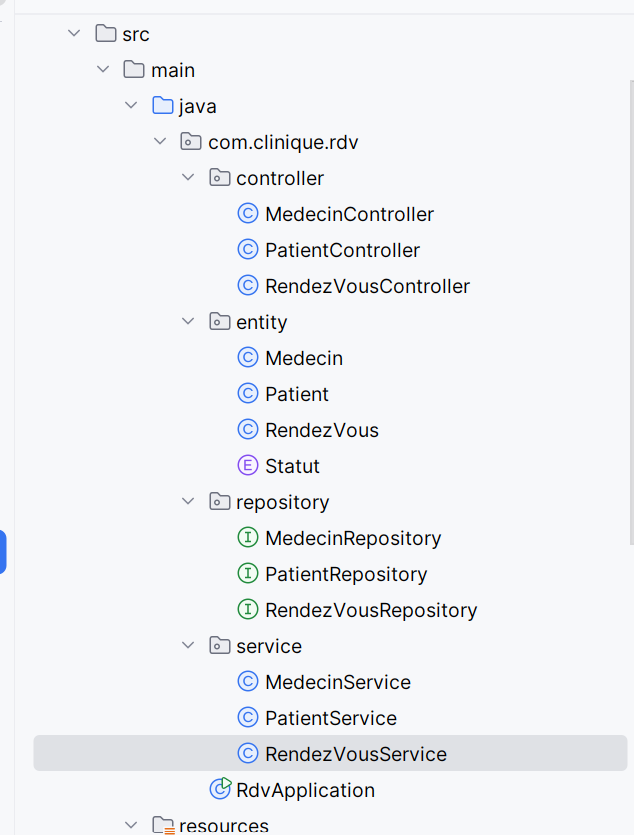
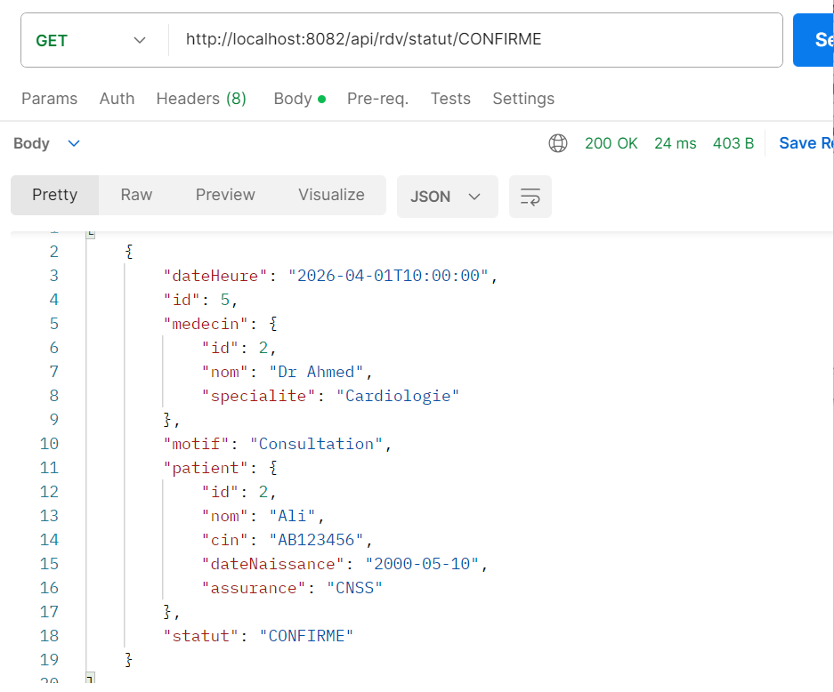
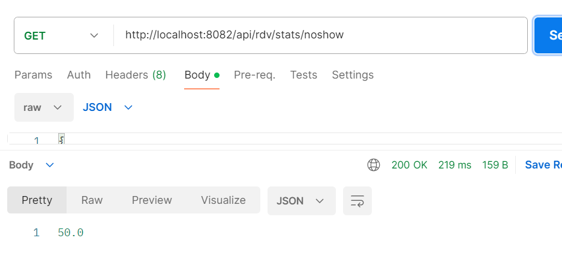

# 🏥 Gestion des Rendez-vous Médicaux (Spring Boot-Thymeleaf)

##  Description

Cette application permet de gérer les rendez-vous entre patients et médecins dans une clinique.


---

## ⚙️ Technologies utilisées

* ☕ Java 17
* 🌱 Spring Boot
* 🗄️ Spring Data JPA
* 🐬 MySQL
* 🔧 Maven
* 📬 Postman (tests API)

---

##  Structure du projet




---


## 🔗 Tests avec Postman
### ➤ Créer un rendez-vous

```http
POST /api/rdv/create/{patientId}/{medecinId}
```


---

### ➤ Valider un rendez-vous

```http
PUT /api/rdv/valider/{id}
```

---

### ➤ Annuler un rendez-vous

```http
PUT /api/rdv/annuler/{id}
```

---

### ➤ Marquer comme absent (No-Show)

```http
PUT /api/rdv/absent/{id}
```

---

### ➤ filtrer par spécialité

```http
GET /api/rdv/specialite/{specialite}
```

---

### ➤ filtrer par statut

```http
GET /api/rdv/statut/{statut}
```

---

### ➤ filtrer par date

```http
GET /api/rdv/date?d1=...&d2=...
```

---

## 📊 Statistiques

### ✔ Taux de No-Show

```http
GET /api/rdv/stats/noshow
```

👉 Interprétation :

> 50% des patients ne se présentent pas à leur rendez-vous.




---

### ✔ Statistiques par spécialité

```http
GET /api/rdv/stats/specialite
```

---

### ✔ Statistiques par mois

```http
GET /api/rdv/stats/mois
```

---


---


## 👨‍💻 Auteur

BOUKARNAOOUI Fadwa


---
